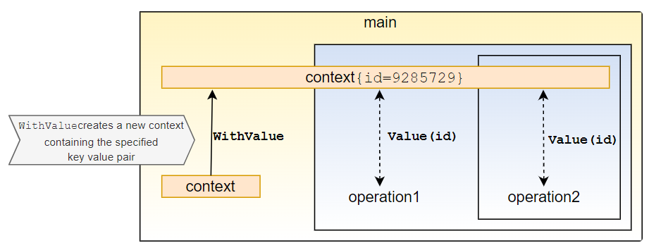

# How to Use Context in Golang (Deadlines, Cancellation, and Passing Values)
* https://tuts.heomi.net/an-introduction-to-channels-in-go-golang/

# Init a Go project

Locate the project directory
```bash
$ mkdir go-contexts
$ cd go-contexts
```

Then create the module
```bash
$ go mod init github.com/favtuts/go-contexts
```

# When do we use Context?

If used correctly, the context package can help you:

* Cancel long running processes that are no longer needed
* Pass around request-scoped data and cancellation signals between function calls
* Set deadlines for processes to complete


The main use of a context instance is to pass common scoped data within our application. For example:

* Request IDs for function calls and goroutines that are part of the same HTTP request
* Errors encountered when fetching data from a database
* Cancellation signals created when performing async operations using goroutines


# Creating a Derived Context


When you receive a context from an external source, you can add your own values and cancellation signals to it by creating a derived context.

We can do this by using a decorator function like [context.WithValue](https://pkg.go.dev/context#WithValue), [context.WithCancel](https://pkg.go.dev/context#WithCancel), or [context.WithDeadline](https://pkg.go.dev/context#WithDeadline):


# Context Cancellation Signals


## Why Do We Need Cancellation?

In short, we need cancellation to prevent our system from doing unnecessary work.

Consider the common situation of an HTTP server making a call to a database, and returning the queried data to the client:


The timing diagram, if everything worked perfectly, would look like this:


But, what would happen if the client cancelled the request in the middle? This could happen if, for example, the client closed their browser mid-request.

Without cancellation, the application server and database would continue to do their work, even though the result of that work would be wasted:


Ideally, we would want all downstream components of a process to halt, if we know that the process (in this example, the HTTP request) halted:


Now that we know why we need cancellation, let’s get into how you can implement it in Go.

Because “cancellation” is highly contextual to the operation being performed, the best way to implement it is through context.

There are two sides to context cancellation:

1. Listening for the cancellation signal
2. Emitting the cancellation signal

## Listening For Cancellation Signals

The `Context` type provides a `Done()` method. This returns a channel that receives an empty `struct{}` type every time the context receives a cancellation signal.

So, to listen for a cancellation signal, we need to wait on `<- ctx.Done()`.

For example, lets consider an HTTP server that takes two seconds to process an event. If the request gets cancelled before that, we want to return immediately:

```go
func main() {
	// Create an HTTP server that listens on port 8000
	http.ListenAndServe(":8000", http.HandlerFunc(func(w http.ResponseWriter, r *http.Request) {
		ctx := r.Context()
		// This prints to STDOUT to show that processing has started
		fmt.Fprint(os.Stdout, "processing request\n")
		// We use `select` to execute a piece of code depending on which
		// channel receives a message first
		select {
		case <-time.After(2 * time.Second):
			// If we receive a message after 2 seconds
			// that means the request has been processed
			// We then write this as the response
			w.Write([]byte("request processed"))
		case <-ctx.Done():
			// If the request gets cancelled, log it
			// to STDERR
			fmt.Fprint(os.Stderr, "request cancelled\n")
		}
	}))
}
```

Run the http server, and open the browser for the URL = `http://localhost:8000`. Between 2 seconds, you close the browser for seiing the `request cancelled` in the log console.
```bash
$ go run http_server_cancel.go
processing request
processing request

request cancelled
```

## Emitting a Cancellation Signal

If you have an operation that could be cancelled, you will have to emit a cancellation signal through the context.

This can be done using the `WithCancel` function in the [context package](https://pkg.go.dev/context#WithCancel), which returns a context object, and a function.

```go
ctx, fn := context.WithCancel(ctx)
```

This function takes no arguments, and does not return anything, and is called when you want to cancel the context.

Consider the case of 2 dependent operations. Here, “dependent” means if one fails, it doesn’t make sense for the other to complete. If we get to know early on that one of the operations failed, we would like to cancel all dependent operations.

```go
func operation1(ctx context.Context) error {
	// Let's assume that this operation failed for some reason
	// We use time.Sleep to simulate a resource intensive operation
	time.Sleep(100 * time.Millisecond)
	return errors.New("failed")
}

func operation2(ctx context.Context) {
	// We use a similar pattern to the HTTP server
	// that we saw in the earlier example
	select {
	case <-time.After(500 * time.Millisecond):
		fmt.Println("done")
	case <-ctx.Done():
		fmt.Println("halted operation2")
	}
}

func main() {
	// Create a new context
	ctx := context.Background()
	// Create a new context, with its cancellation function
	// from the original context
	ctx, cancel := context.WithCancel(ctx)

	// Run two operations: one in a different go routine
	go func() {
		err := operation1(ctx)
		// If this operation returns an error
		// cancel all operations using this context
		if err != nil {
			cancel()
		}
	}()

	// Run operation2 with the same context we use for operation1
	operation2(ctx)
}
```

Run the code example:
```bash
$ go run cancellation.go 
halted operation2
```

## Cancellation Signals with Causes

In the previous example, calling the `cancel()` function did not provide any information about why the context was cancelled. There are some cases where you might want to know the reason for cancellation.

In these cases, we can use the [context.WithCancelCause](https://pkg.go.dev/context#WithCancelCause) instead. This function returns a context object, and a function that takes an error as an argument.


```go
func operation1(ctx context.Context) error {
	time.Sleep(100 * time.Millisecond)
	return errors.New("failed")
}

func operation2(ctx context.Context) {
	select {
	case <-time.After(500 * time.Millisecond):
		fmt.Println("done")
	case <-ctx.Done():
    // We can get the error from the context
    err := context.Cause(ctx)
		fmt.Println("halted operation2 due to error: ", err)
	}
}

func main() {
	ctx := context.Background()
	ctx, cancel := context.WithCancelCause(ctx)

	go func() {
		err := operation1(ctx)
		if err != nil {
      // this time, we pass in the error as an argument
			cancel(err)
		}
	}()

	// Run operation2 with the same context we use for operation1
	operation2(ctx)
}
```

Run the code:
```bash
$ go run cancel_with_cause.go 
halted operation2 due to error:  failed
```

# Context Deadlines

If we want to set a deadline for a process to complete, we should use `time` based cancellation.

The functions are almost the same as the previous example, with a few additions:

```go
// The context will be cancelled after 3 seconds
// If it needs to be cancelled earlier, the `cancel` function can
// be used, like before
ctx, cancel := context.WithTimeout(ctx, 3*time.Second)

// Setting a context deadline is similar to setting a timeout, except
// you specify a time when you want the context to cancel, rather than a duration.
// Here, the context will be cancelled on 2009-11-10 23:00:00
ctx, cancel := context.WithDeadline(ctx, time.Date(2009, time.November, 10, 23, 0, 0, 0, time.UTC))
```

For example, consider making an HTTP API call to an external service. If the service takes too long, it’s better to fail early and cancel the request:

```go
func main() {
	// Create a new context
	// With a deadline of 100 milliseconds
	ctx := context.Background()
	ctx, _ = context.WithTimeout(ctx, 100*time.Millisecond)

	// Make a request, that will call the google homepage
	req, _ := http.NewRequest(http.MethodGet, "http://google.com", nil)
	// Associate the cancellable context we just created to the request
	req = req.WithContext(ctx)

	// Create a new HTTP client and execute the request
	client := &http.Client{}
	res, err := client.Do(req)
	// If the request failed, log to STDOUT
	if err != nil {
		fmt.Println("Request failed:", err)
		return
	}
	// Print the status code if the request succeeds
	fmt.Println("Response received, status code:", res.StatusCode)
}
```

Run the code:
```bash
$ go run deadline.go 
Request failed: Get "http://google.com": context deadline exceeded
```

# Context Values

You can use the context variable to propagate request scoped values that are common across an operation. 

Some example of values that you might want to propagate using the context variable are:

1. Request IDs, so that you can trace the execution of a request across multiple function calls.
2. Errors encountered when fetching data from a database
3. Authentication tokens and user information

We can implement the same functionality using the [context.WithValue](https://pkg.go.dev/context#WithValue) decorator function:



```go
// we need to set a key that tells us where the data is stored
const keyID = "id"

func main() {
	// create a request ID as a random number
  rand.Seed(time.Now().Unix())
  requestID := rand.Intn(1000)

  // create a new context variable with a key value pair
	ctx := context.WithValue(context.Background(), keyID, requestID)
	operation1(ctx)
}

func operation1(ctx context.Context) {
	// do some work

	// we can get the value from the context by passing in the key
	log.Println("operation1 for id:", ctx.Value(keyID), " completed")
	operation2(ctx)
}

func operation2(ctx context.Context) {
	// do some work

	// this way, the same ID is passed from one function call to the next
	log.Println("operation2 for id:", ctx.Value(keyID), " completed")
}
```

Run the code:
```bash
$ go run values.go 
2024/09/25 10:15:49 operation1 for id: 364  completed
2024/09/25 10:15:49 operation2 for id: 364  completed
```

Here, we’re creating a new context variable in the main function and a key value pair associated with it. The value can then be used by the successive function calls to obtain contextual information.


