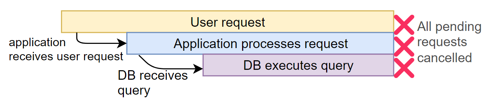

# How to Use Context in Golang (Deadlines, Cancellation, and Passing Values)
* https://tuts.heomi.net/an-introduction-to-channels-in-go-golang/

# Init a Go project

Locate the project directory
```bash
$ mkdir go-contexts
$ cd go-contexts
```

Then create the module
```bash
$ go mod init github.com/favtuts/go-contexts
```

# Why Do We Need Cancellation?

In short, we need cancellation to prevent our system from doing unnecessary work.

Consider the common situation of an HTTP server making a call to a database, and returning the queried data to the client:


The timing diagram, if everything worked perfectly, would look like this:


But, what would happen if the client cancelled the request in the middle? This could happen if, for example, the client closed their browser mid-request.

Without cancellation, the application server and database would continue to do their work, even though the result of that work would be wasted:


Ideally, we would want all downstream components of a process to halt, if we know that the process (in this example, the HTTP request) halted:



Now that we know why we need cancellation, let’s get into how you can implement it in Go.

Because “cancellation” is highly contextual to the operation being performed, the best way to implement it is through context.

There are two sides to context cancellation:

1. Listening for the cancellation signal
2. Emitting the cancellation signal

# Listening For Cancellation Signals

The `Context` type provides a `Done()` method. This returns a channel that receives an empty `struct{}` type every time the context receives a cancellation signal.

So, to listen for a cancellation signal, we need to wait on `<- ctx.Done()`.

For example, lets consider an HTTP server that takes two seconds to process an event. If the request gets cancelled before that, we want to return immediately:

```go
func main() {
	// Create an HTTP server that listens on port 8000
	http.ListenAndServe(":8000", http.HandlerFunc(func(w http.ResponseWriter, r *http.Request) {
		ctx := r.Context()
		// This prints to STDOUT to show that processing has started
		fmt.Fprint(os.Stdout, "processing request\n")
		// We use `select` to execute a piece of code depending on which
		// channel receives a message first
		select {
		case <-time.After(2 * time.Second):
			// If we receive a message after 2 seconds
			// that means the request has been processed
			// We then write this as the response
			w.Write([]byte("request processed"))
		case <-ctx.Done():
			// If the request gets cancelled, log it
			// to STDERR
			fmt.Fprint(os.Stderr, "request cancelled\n")
		}
	}))
}
```

Run the http server, and open the browser for the URL = `http://localhost:8000`. Between 2 seconds, you close the browser for seiing the `request cancelled` in the log console.
```bash
$ go run http_server_cancel.go
processing request
processing request

request cancelled
```