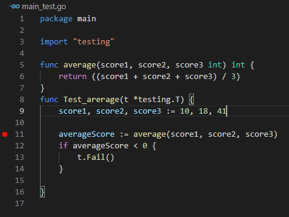

#  Debugging Go with VS Code 
* https://tuts.heomi.net/debugging-go-with-vs-code/


# Prequisites

[`Go`](https://marketplace.visualstudio.com/items?itemName=golang.go) and [`Delve`](https://github.com/go-delve/delve/) extensions installed in your VS Code editor


Install Delve:
```bash
$ go install github.com/go-delve/delve/cmd/dlv@latest
```

Debug with Delve:
```bash
$ dlv debug
$ dlv debug ./hello
```


# Creating a sample app

```bash
mkdir go-debugging
cd go-debugging
go mod init github.com/favtuts/go-debugging
touch cmd/go-debugging/main.go
```

Open the main.go file and add the following code:
```go
package main

import (
   "encoding/json"
   "fmt"
   "log"
)


type user struct {
   FullName string `json:"full_name"`
   Email string `json:"email"`
   Gender   string `json:"gender"`
   Status   string `json:"status"`
   RegDate   string `json:"Reg_date"`
}


func main() {
   userinfos := []user{
       {
           FullName: "blessing james",
           Email: "blessing@gmail.com",
           Gender:   "Male",
           Status:   "active",
           RegDate:"20-01-2021",
       },
       {
           FullName: "matt john",
           Email: "matt@gmail.com",
           Gender:   "Male",
           Status:   "active",
           RegDate:"20-01-2021",
       },
       {
           FullName: "john peace",
           Email: "peace@gmail.com",
           Gender:   "Midgard",
           Status:   "active",
           RegDate:"20-01-2021",
       },
   }


   jsonBytes, err := json.Marshal(userinfos)
   if err != nil {
       log.Fatalln(err)
   }
   fmt.Println(string(jsonBytes))
}
```

You can execute the application using the command below:
```bash
$ go run main.go

[{"full_name":"blessing james","email":"blessing@gmail.com","gender":"Male","status":"active","Reg_date":"20-01-2021"},{"full_name":"matt john","email":"matt@gmail.com","gender":"Male","status":"active","Reg_date":"20-01-2021"},{"full_name":"john peace","email":"peace@gmail.com","gender":"Midgard","status":"active","Reg_date":"20-01-2021"}]
```

# Setting up a debugging session

From your VS Code’s sidebar menu, click on the Run and Debug button, then click on create a `launch.json` file:


You’ll see a dropdown menu where you can select your `workspace folder`. Then, select Go for environment language. Finally, select `Launch Package` for debug configuration. This configuration will create the `launch.json` file, which will contain the following code:
```json
{
    // Use IntelliSense to learn about possible attributes.
    // Hover to view descriptions of existing attributes.
    // For more information, visit: https://go.microsoft.com/fwlink/?linkid=830387
    "version": "0.2.0",
    "configurations": [
        {
            "name": "Launch Package",
            "type": "go",
            "request": "launch",
            "mode": "auto",
            "program": "main.go"
        } 
    ]
}
```

Change the value for `program` in the JSON settings above to the application file name, `main.go` in our case:
```json
"program": "main.go"
```

To debug the application, click on the play icon near `RUN AND DEBUG`, which will display the program output in the `DEBUG CONSOLE` window:


# Debugging using unit testing

We can also use unit testing to debug Go applications; unit testing helps to ensure that each component of the application performs its intended function properly. 

Create a test file named main_test.go and add the following code to the file:
```go
package main
import "testing"

func average(score1, score2, score3 int) int {
    return ((score1 + score2 + score3) / 3)
}
func Test_arerage(t *testing.T) {
    score1, score2, score3 := 10, 18, 41

    averageScore := average(score1, score2, score3)
    if averageScore == 0 {
        t.Fail()
    }

}
```

The two functions above enable us to calculate the average value of three numbers. The function to be tested (`Test_average`) is preceded by the `Test_` keyword. 

To run the unit test, enter the command below:
```bash
$ go test

PASS
ok      github.com/favtuts/go-debugging 0.002s
```

Now let’s debug our test file by adding a breakpoint to the program as shown below:




Now you can start the debugging session, then use the Debug Tool to step over and inspect each variable and change their value under the variables section.

