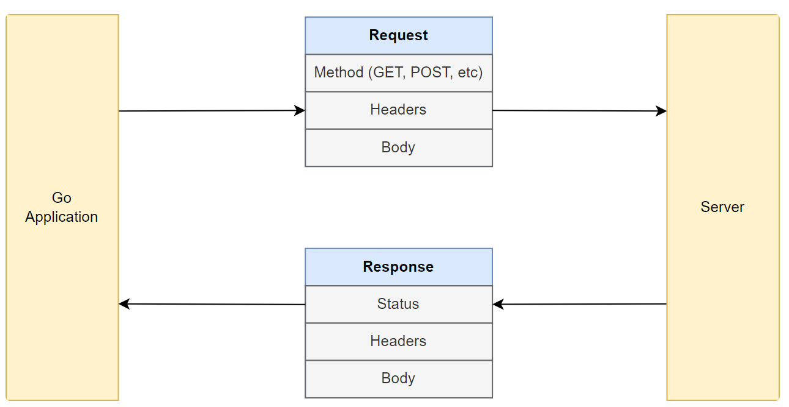

#  Making REST API Requests in Golang using the HTTP Client 
* https://tuts.heomi.net/making-rest-api-requests-in-golang-using-the-http-client/

# Init a Go project

Locate the project directory
```bash
$ mkdir http-client-demo
$ cd http-client-demo
```

Then create the module
```bash
$ go mod init github.com/favtuts/http-client
```

# The HTTP Client Library

Most of the functionality for making HTTP requests is provided by the [net/http](https://pkg.go.dev/net/http) package. This package provides a [Client type](https://pkg.go.dev/net/http#Client) that we can use to make HTTP requests.

**Requests and Responses**

Whenever we make an HTTP request, we need to specify the HTTP method (GET, POST, etc), the URL, and the request body (if any).

In return, we get an HTTP response. The response contains the response body, the status code, and some other metadata. In Go, the response is represented by the [Response type](https://pkg.go.dev/net/http#Response).



# Making a GET Request

For example, to make a GET request, we can use the [http.Get](https://pkg.go.dev/net/http#Get) method.

```go
func main() {
	url := "http://www.example.com"
	resp, err := http.Get(url)
	if err != nil {
		// we will get an error at this stage if the request fails, such as if the
		// requested URL is not found, or if the server is not reachable.
		log.Fatal(err)
	}
	defer resp.Body.Close()

	// if we want to check for a specific status code, we can do so here
	// for example, a successful request should return a 200 OK status
	if resp.StatusCode != http.StatusOK {
		// if the status code is not 200, we should log the status code and the
		// status string, then exit with a fatal error
		log.Fatalf("status code error: %d %s", resp.StatusCode, resp.Status)
	}

	// print the response
	data, err := ioutil.ReadAll(resp.Body)
	if err != nil {
		log.Fatal(err)
	}
	fmt.Println(string(data))
}
```

Run the code:
```bash
$ go run get_request.go 
<!doctype html>
<html>
<head>
    <title>Example Domain</title>

    <meta charset="utf-8" />
    <meta http-equiv="Content-type" content="text/html; charset=utf-8" />
    <meta name="viewport" content="width=device-width, initial-scale=1" />
    <style type="text/css">
    body {
        background-color: #f0f0f2;
        margin: 0;
        padding: 0;
        font-family: -apple-system, system-ui, BlinkMacSystemFont, "Segoe UI", "Open Sans", "Helvetica Neue", Helvetica, Arial, sans-serif;
        
    }

    ....
    </style>    
</head>

<body>
<div>
    <h1>Example Domain</h1>
    <p>This domain is for use in illustrative examples in documents. You may use this
    domain in literature without prior coordination or asking for permission.</p>
    <p><a href="https://www.iana.org/domains/example">More information...</a></p>
</div>
</body>
</html>
```

# Making a POST Request

To make a POST request, we can use the [http.Post](https://pkg.go.dev/net/http#Post) method. This method takes in the URL, the content type, and the request body as parameters.

The request body allows us to send data to the server, which is not possible with a GET request. Let’s see how we can send plain text data as the request body:

```go
func main() {
	// we will run an HTTP server locally to test the POST request
	url := "http://localhost:3000/"

	// create post body
	body := strings.NewReader("This is the request body.")

	resp, err := http.Post(url, "text/plain", body)
	if err != nil {
		// we will get an error at this stage if the request fails, such as if the
		// requested URL is not found, or if the server is not reachable.
		log.Fatal(err)
	}
	defer resp.Body.Close()

	// print the status code
	fmt.Println("Status:", resp.Status)
}
```

To test this request, we will need to run an HTTP server locally. We will do this using the [http-echo-server package](https://github.com/watson/http-echo-server).
After installation, we can run the command `http-echo-server 3000` on a new terminal to start the server on port 3000.

This echo server will return a 200 (OK) response for any request sent to `http://localhost:3000` and print the request details, like the method, path, headers and body.

```bash
$ nvm ls
        v6.17.1
       v10.24.1
      v12.22.12
       v14.21.2
       v18.20.3
->     v20.14.0
$ node -v
v20.14.0
$ npm --version
10.8.2
$ npm install http-echo-server -g

added 2 packages in 2s
npm notice
npm notice New patch version of npm available! 10.8.2 -> 10.8.3
npm notice Changelog: https://github.com/npm/cli/releases/tag/v10.8.3
npm notice To update run: npm install -g npm@10.8.3
npm notice
```

To the start the echo server:
```bash
$ http-echo-server 3000
[server] event: listening (port: 3000)
```

Or use the `PORT` environment:
```bash
export PORT=3000
http-echo-server
```

Run the code example:
```bash
$ go run post_request.go 
Status: 200 OK
```

Then you can check the http-echo-server console:
```bash
[server] event: connection (socket#1)
[socket#1] event: resume
[socket#1] event: data
--> POST / HTTP/1.1
--> Host: localhost:3000
--> User-Agent: Go-http-client/1.1
--> Content-Length: 25
--> Content-Type: text/plain
--> Accept-Encoding: gzip
-->
--> This is the request body.
[socket#1] event: readable
[socket#1] event: end
[socket#1] event: prefinish
[socket#1] event: finish
[socket#1] event: close
```

## Sending JSON Data

Sending JSON data is a common use case for POST requests. To send JSON data, we can use the [http.Post](https://pkg.go.dev/net/http#Post) method, but we need to make some changes:

1. We need to set the content type header to `application/json` - this tells the server that the request body is a JSON string
2. The request body needs to be a JSON string - we can use the JSON standard library to convert a Go struct to a JSON string

```go
// Person is a struct that represents the data we will send in the request body
type Person struct {
	Name string
	Age  int
}

func main() {
	url := "http://localhost:3000"

	// create post body using an instance of the Person struct
	p := Person{
		Name: "John Doe",
		Age:  25,
	}
	// convert p to JSON data
	jsonData, err := json.Marshal(p)
	if err != nil {
		log.Fatal(err)
	}

	// We can set the content type here
	resp, err := http.Post(url, "application/json", bytes.NewReader(jsonData))
	if err != nil {
		log.Fatal(err)
	}
	defer resp.Body.Close()

	fmt.Println("Status:", resp.Status)
}
```

Run the code:
```bash
$ go run post_request_json.go 
Status: 200 OK
```

Output from the echo server
```bash
[server] event: connection (socket#2)
[socket#2] event: resume
[socket#2] event: data
--> POST / HTTP/1.1
--> Host: localhost:3000
--> User-Agent: Go-http-client/1.1
--> Content-Length: 28
--> Content-Type: application/json
--> Accept-Encoding: gzip
-->
--> {"Name":"John Doe","Age":25}
[socket#2] event: readable
[socket#2] event: end
[socket#2] event: prefinish
[socket#2] event: finish
[socket#2] event: close
```

As we can see, the server received the stringified JSON data as the request body, and the `Content-Type` header value is set to `application/json`.


## Parsing JSON Responses

We can use the JSON standard library to parse JSON data from the response body into a Go struct. Let’s look at an example:
```go
// parse the response
responsePerson := Person{}
err = json.NewDecoder(resp.Body).Decode(&responsePerson)
if err != nil {
	log.Fatal(err)
}
```

# Making PUT, PATCH, and DELETE Requests

Unlike the `http.Get` and `http.Post` methods, there are no helper methods for PUT, PATCH, and DELETE requests.

Instead, we need to use the [http.NewRequest](https://pkg.go.dev/net/http#NewRequest) method to create a new request, and then use the [http.Client.Do](https://pkg.go.dev/net/http#Client.Do) method to send the request:

```go
func main() {
	// declare the request url and body
	url := "http://localhost:3000/some/path"
	body := strings.NewReader("This is the request body.")

	// we can set a custom method here, like http.MethodPut
	// or http.MethodDelete, http.MethodPatch, etc.
	req, err := http.NewRequest(http.MethodPut, url, body)
	if err != nil {
		log.Fatal(err)
	}

	resp, err := http.DefaultClient.Do(req)
	if err != nil {
		// we will get an error at this stage if the request fails, such as if the
		// requested URL is not found, or if the server is not reachable.
		log.Fatal(err)
	}
	defer resp.Body.Close()

	// print the status code
	fmt.Println("Status:", resp.Status)
}
```

Run the code:
```bash
$ go run custom_request.go 
Status: 200 OK
```

Output from the echo server:
```bash
--> PUT /some/path HTTP/1.1
--> Host: localhost:3000
--> User-Agent: Go-http-client/1.1
--> Content-Length: 25
--> Accept-Encoding: gzip
-->
--> This is the request body.
```