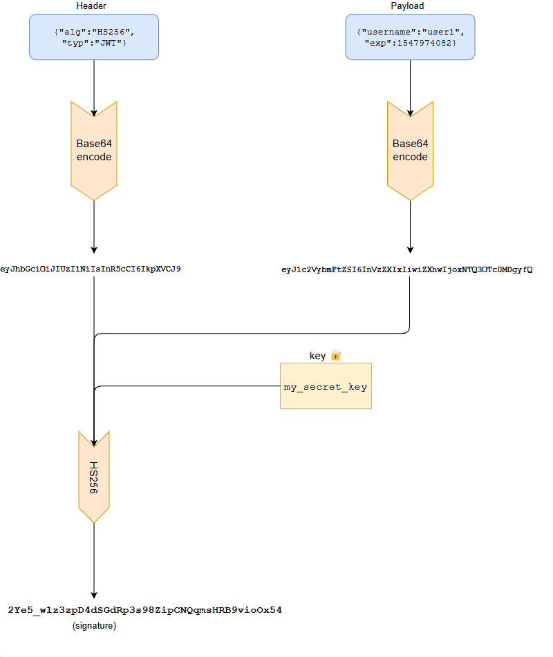
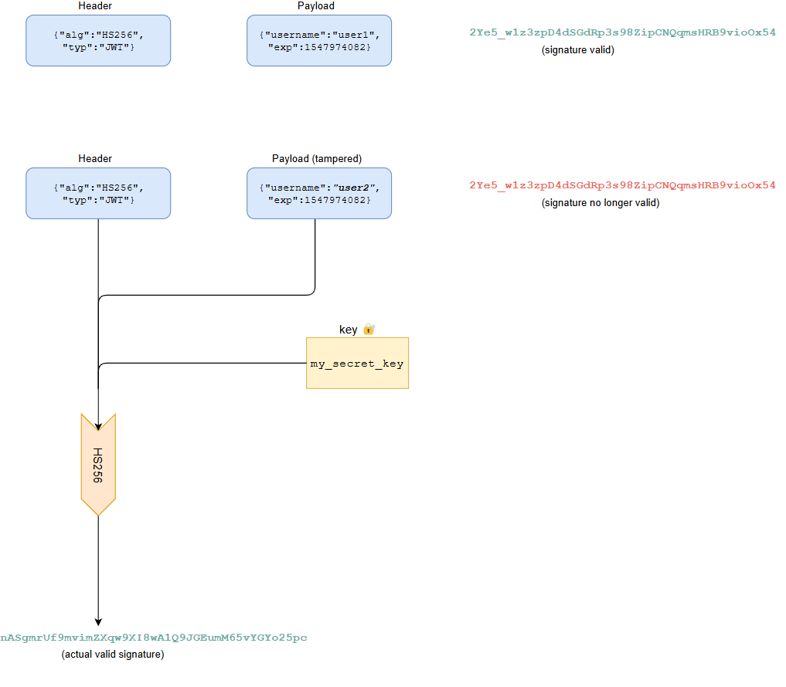

#  Implementing JWT based authentication in Golang 
* https://tuts.heomi.net/implementing-jwt-based-authentication-in-golang/

# Init a Go project

Locate the project directory
```bash
$ mkdir jwt-go-example
$ cd jwt-go-example
```

Then create the module
```bash
$ go mod init github.com/favtuts/jwt-go-example
```

Install the dependencies:
```bash
$ go get -u github.com/golang-jwt/jwt/v5
```

# How the JWT Signature Works

Here is the flow of JWT generation:



To verify a JWT, the server generates the signature once again using the header and payload from the incoming JWT, and its secret key. If the newly generated signature matches the one on the JWT, then the JWT is considered valid.




# Creating the HTTP Server

Let’s start by initializing the HTTP server with the required routes:
```go
package main

import (
	"log"
	"net/http"
)

func main() {
	// we will implement these handlers
	http.HandleFunc("/signin", Signin)
	http.HandleFunc("/welcome", Welcome)
	http.HandleFunc("/refresh", Refresh)
	http.HandleFunc("/logout", Logout)

	// start the server on port 8080
	log.Fatal(http.ListenAndServe(":8080", nil))
}
```

# Handling User Sign In

The `/signin` route will take the users credentials and log them in.

Let’s first define the users data, and some types to represent the credentials and JWT claims:
```go
import (
	//...
	// import the jwt-go library
	"github.com/golang-jwt/jwt/v5"
	//...
)

// Create the JWT key used to create the signature
var jwtKey = []byte("my_secret_key")

// For simplification, we're storing the users information as an in-memory map in our code
var users = map[string]string{
	"user1": "password1",
	"user2": "password2",
}

// Create a struct to read the username and password from the request body
type Credentials struct {
	Password string `json:"password"`
	Username string `json:"username"`
}

// Create a struct that will be encoded to a JWT.
// We add jwt.RegisteredClaims as an embedded type, to provide fields like expiry time
type Claims struct {
	Username string `json:"username"`
	jwt.RegisteredClaims
}
```

Next, we can write the `Signin` HTTP handler. For this example we are using the [golang-jwt/jwt](https://github.com/golang-jwt/jwt) library to help us create and verify JWT tokens.
```go
// Create the Signin handler
func Signin(w http.ResponseWriter, r *http.Request) {
	var creds Credentials
	// Get the JSON body and decode into credentials
	err := json.NewDecoder(r.Body).Decode(&creds)
	if err != nil {
		// If the structure of the body is wrong, return an HTTP error
		w.WriteHeader(http.StatusBadRequest)
		return
	}

	// Get the expected password from our in memory map
	expectedPassword, ok := users[creds.Username]

	// If a password exists for the given user
	// AND, if it is the same as the password we received, the we can move ahead
	// if NOT, then we return an "Unauthorized" status
	if !ok || expectedPassword != creds.Password {
		w.WriteHeader(http.StatusUnauthorized)
		return
	}

	// Declare the expiration time of the token
	// here, we have kept it as 5 minutes
	expirationTime := time.Now().Add(5 * time.Minute)
	// Create the JWT claims, which includes the username and expiry time
	claims := &Claims{
		Username: creds.Username,
		RegisteredClaims: jwt.RegisteredClaims{
			// In JWT, the expiry time is expressed as unix milliseconds
			ExpiresAt: jwt.NewNumericDate(expirationTime),
		},
	}

	// Declare the token with the algorithm used for signing, and the claims
	token := jwt.NewWithClaims(jwt.SigningMethodHS256, claims)
	// Create the JWT string
	tokenString, err := token.SignedString(jwtKey)
	if err != nil {
		// If there is an error in creating the JWT return an internal server error
		w.WriteHeader(http.StatusInternalServerError)
		return
	}

	// Finally, we set the client cookie for "token" as the JWT we just generated
	// we also set an expiry time which is the same as the token itself
	http.SetCookie(w, &http.Cookie{
		Name:    "token",
		Value:   tokenString,
		Expires: expirationTime,
	})
}
```

If a user logs in with the correct credentials, this handler will then set a cookie on the client side with the JWT value. Once a cookie is set on a client, it is sent along with every request henceforth. Now we can write our welcome handler to handle user specific information.


# Handling Post Authentication Routes

Now that all logged in clients have session information stored on their end as cookies, we can use it to:

* Authenticate subsequent user requests
* Get information about the user making the request

Let’s write our `Welcome` handler to do just that:
```go
func Welcome(w http.ResponseWriter, r *http.Request) {
	// We can obtain the session token from the requests cookies, which come with every request
	c, err := r.Cookie("token")
	if err != nil {
		if err == http.ErrNoCookie {
			// If the cookie is not set, return an unauthorized status
			w.WriteHeader(http.StatusUnauthorized)
			return
		}
		// For any other type of error, return a bad request status
		w.WriteHeader(http.StatusBadRequest)
		return
	}

	// Get the JWT string from the cookie
	tknStr := c.Value

	// Initialize a new instance of `Claims`
	claims := &Claims{}

	// Parse the JWT string and store the result in `claims`.
	// Note that we are passing the key in this method as well. This method will return an error
	// if the token is invalid (if it has expired according to the expiry time we set on sign in),
	// or if the signature does not match
	tkn, err := jwt.ParseWithClaims(tknStr, claims, func(token *jwt.Token) (any, error) {
		return jwtKey, nil
	})
	if err != nil {
		if err == jwt.ErrSignatureInvalid {
			w.WriteHeader(http.StatusUnauthorized)
			return
		}
		w.WriteHeader(http.StatusBadRequest)
		return
	}
	if !tkn.Valid {
		w.WriteHeader(http.StatusUnauthorized)
		return
	}
	// Finally, return the welcome message to the user, along with their
	// username given in the token
	w.Write([]byte(fmt.Sprintf("Welcome %s!", claims.Username)))
}
```

# Renewing Your Token

In this example, we have set a short expiry time of five minutes. We should not expect the user to login every five minutes if their token expires.

To solve this, we will create another `/refresh` route that takes the previous token (which is still valid), and returns a new token with a renewed expiry time.

To minimize misuse of a JWT, the expiry time is usually kept in the order of a few minutes. Typically the client application would refresh the token in the background.

```go
func Refresh(w http.ResponseWriter, r *http.Request) {
	// (BEGIN) The code until this point is the same as the first part of the `Welcome` route
	c, err := r.Cookie("token")
	if err != nil {
		if err == http.ErrNoCookie {
			w.WriteHeader(http.StatusUnauthorized)
			return
		}
		w.WriteHeader(http.StatusBadRequest)
		return
	}
	tknStr := c.Value
	claims := &Claims{}
	tkn, err := jwt.ParseWithClaims(tknStr, claims, func(token *jwt.Token) (any, error) {
		return jwtKey, nil
	})
	if err != nil {
		if err == jwt.ErrSignatureInvalid {
			w.WriteHeader(http.StatusUnauthorized)
			return
		}
		w.WriteHeader(http.StatusBadRequest)
		return
	}
	if !tkn.Valid {
		w.WriteHeader(http.StatusUnauthorized)
		return
	}
	// (END) The code until this point is the same as the first part of the `Welcome` route

	// We ensure that a new token is not issued until enough time has elapsed
	// In this case, a new token will only be issued if the old token is within
	// 30 seconds of expiry. Otherwise, return a bad request status
	if time.Until(claims.ExpiresAt.Time) > 30*time.Second {
		w.WriteHeader(http.StatusBadRequest)
		return
	}

	// Now, create a new token for the current use, with a renewed expiration time
	expirationTime := time.Now().Add(5 * time.Minute)
	claims.ExpiresAt = jwt.NewNumericDate(expirationTime)
	token := jwt.NewWithClaims(jwt.SigningMethodHS256, claims)
	tokenString, err := token.SignedString(jwtKey)
	if err != nil {
		w.WriteHeader(http.StatusInternalServerError)
		return
	}

	// Set the new token as the users `token` cookie
	http.SetCookie(w, &http.Cookie{
		Name:    "token",
		Value:   tokenString,
		Expires: expirationTime,
	})
}
```