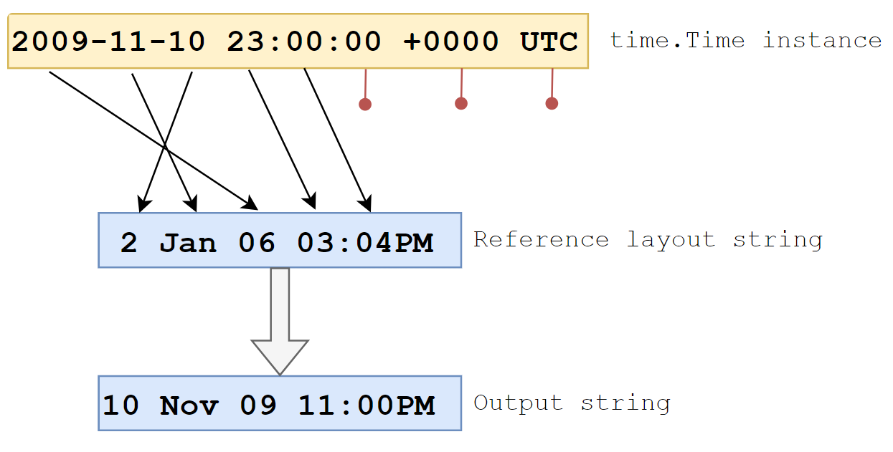
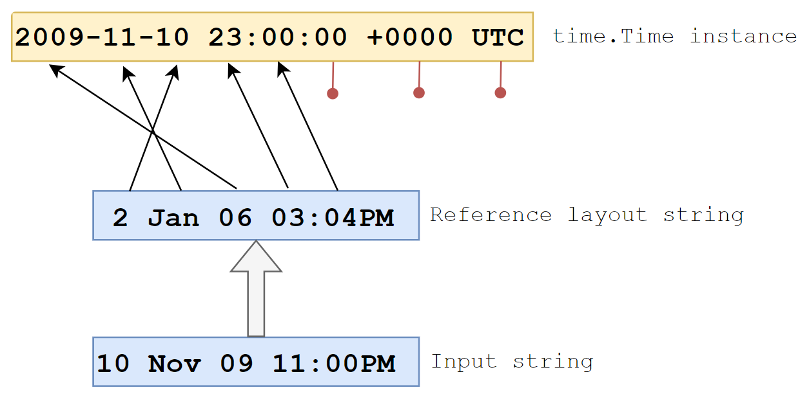

# Time in Golang – Working With Time, Duration, and Dates (With Examples)
* https://tuts.heomi.net/time-in-golang-working-with-time-duration-and-dates-with-examples/

# Init a Go project

Locate the project directory
```bash
$ mkdir time-examples
$ cd time-examples
```

Then create the module
```bash
$ go mod init github.com/favtuts/time-examples
```

# Getting the Current System Time

Let’s begin by creating a new `Time` instance from the current system time:
```go
package main

import (
	"fmt"
	"time"
)

func main() {
	now := time.Now()
	fmt.Println(now.String())
}
```

After importing the `time` standard library, we call the `time.Now()` function, which returns the current system time (current local time).

Calling the `String()` method returns the time as a formatted string.

Run the code:
```bash
$ go run get_current_system_time.go 
2024-10-03 15:06:51.255960778 +0700 +07 m=+0.000023877
```

# Formatting Time to a String

We can use the Format method of any Time instance to return a string in our custom format.

For example:
```go
now := time.Now()
fmt.Println(now.Format("2 Jan 06 03:04PM")) // Output: 10 Nov 09 11:00PM 
```

The date and time in the argument of the `Format` method must be the same as the [Layout constant](https://pkg.go.dev/time#pkg-constants), which is defined as:
```bash
01/02 03:04:05PM '06 -0700
```

Note: `01/02` refers to the American convention of `MM/DD`, which would be the 2nd of January.
`'06` refers to the year 2006, and `-0700` refers to the timezone.

The time library uses this as a reference to map different components of a string to the time that it’s referring to.



Run the code above:
```bash
$ go run format_time_layout_string.go 
3 Oct 24 03:18PM
```

We can also use some of the formats defined in the constants to conveniently format our string into recognized standard formats.

For example, we can use the `time.UnixDate` layout format to return a Unix-formatted date string:
```go
now := time.Now()
fmt.Println(now.Format(time.UnixDate))
fmt.Println(now.Format(time.RubyDate))
```

Run the code:
```bash
$ go run format_time_layout_predefined.go 
Thu Oct  3 15:21:22 +07 2024
Thu Oct 03 15:21:22 +0700 2024
```

# Parsing Time Strings

The `time.Parse` function takes a string as input and returns a `Time` instance. The `time` library uses the same layout mechanism from the previous section to convert a string into a `Time` instance.

Here’s how to parse a custom-formatted string:
```go
myTime, err := time.Parse("2 Jan 06 03:04PM", "10 Nov 09 11:00PM") 
if err != nil {
	panic(err) 
}
fmt.Println(myTime) 
```

This is essentially the inverse of the `Format` method.




Run the code:
```bash
$ go run parse_time_strings.go 
2009-11-10 23:00:00 +0000 UTC
```

# Duration - Adding and Subtracting Time

Go uses the `Duration` type to represent the difference between two instances of time.
```go
myTime, err := time.Parse("2 Jan 06 03:04PM", "10 Nov 09 11:00PM")
if err != nil {
	panic(err)
}
now := time.Now()
difference := myTime.Sub(now) 
fmt.Println(difference) // Output: 8760h0m0s
```

The `difference` variable is of type `Duration` and represents an elapsed duration of time.

We can convert this duration into different units like hours or milliseconds:
```go
fmt.Println(difference.Hours())      // Output: 8760
fmt.Println(difference.Milliseconds()) // Output: 31536000000
```

We can also add a duration to an existing time using the `Add` method:
```go
now := time.Now()
later := now.Add(3 * time.Hour)
fmt.Println("now: ", now, "\nlater: ", later)
```

# Time Comparison

To compare time instances, use the `Before`, `After`, and `Equal` methods:
```go
myTime, err := time.Parse("2 Jan 06 03:04PM", "11 Nov 09 11:00PM")
if err != nil {
	panic(err)
}
now := time.Now()
fmt.Println(now.Before(myTime)) 
fmt.Println(now.After(myTime))  
fmt.Println(now.Equal(myTime)) 
```

Run the code:
```bash
$ go run compare_time_values.go 
false
true
false
```

# Getting Unix/Epoch Time

Unix or Epoch time represents the number of seconds elapsed since January 1, 1970 UTC.

Get the epoch time using the `Unix` and `UnixMilli` methods:
```go
now := time.Now()
fmt.Println(now.Unix())       // Output: 1257894000
fmt.Println(now.UnixMilli())  // Output: 1257894000000
```

Run the code:
```bash
$ go run get_unix_epoch_time.go 
1727945163
1727945163158
```

# Working with Time Zones

Use `time.LoadLocation` to get a specific time zone and `time.In` to assign it to a `Time` instance.
```go
loc, err := time.LoadLocation("America/New_York")
if err != nil {
	panic(err)
}
now := time.Now().In(loc)
fmt.Println("Current time in New York:", now) // Output: Current time in New York: 2009-11-10 18:00:00 -0500 EST
```

Run the code:
```bash
$ go run work_with_time_zones.go 
Current time in New York: 2024-10-03 04:47:41.070139206 -0400 EDT
```

Convert a time to UTC using the `UTC()` method:
```go
utcTime := now.UTC() 
fmt.Println(utcTime) 
```

Run the code:
```bash
$ go run work_with_time_zones.go 
2024-10-03 08:48:29.970286677 +0000 UTC
```

Avoid using `time.Local` unless you’re certain you need the system’s local time zone.

# Using time.Ticker and time.Timer

`time.Ticker` allows you to execute code at regular intervals:
```go
ticker := time.NewTicker(5 * time.Second)
defer ticker.Stop() // Ensure clean-up

for {
	<-ticker.C 
	// Code to execute every 5 seconds
}
```

Run the code:
```bash
$ go run work_with_time_ticker.go 
2024-10-03 15:56:42.020464839 +0700 +07 m=+5.004301468
2024-10-03 15:56:47.019968687 +0700 +07 m=+10.003805289
2024-10-03 15:56:52.020090413 +0700 +07 m=+15.003927037
```


`time.Timer` is used for one-off events after a specific duration:
```go
timer := time.NewTimer(10 * time.Second)
defer timer.Stop() 

<-timer.C 
// Code to execute after 10 seconds
```

Run the code:
```bash
$ go run work_with_time_timer.go 
2024-10-03 15:55:50.793340522 +0700 +07 m=+10.009450388
```