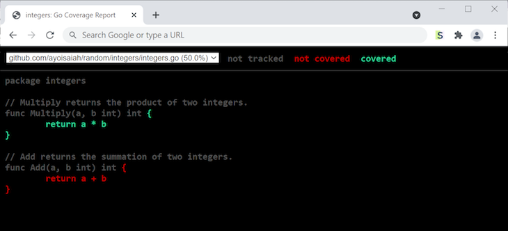

# A deep dive into unit testing in Go
* https://tuts.heomi.net/a-deep-dive-into-unit-testing-in-go/

# Init a Go project

Locate the project directory
```bash
$ mkdir unit-testing-demo
$ cd unit-testing-demo
```

Then create the module
```bash
$ go mod init github.com/favtuts/unit-testing
```

# Writing your first test in Go

First, create a file called `integers.go` and add the following code:
```go
// integers.go
package main

import (
    "fmt"
)

// Multiply returns the product of two integers
func Multiply(a, b int) int {
    return a * b
}
```

Let’s write a test to verify that the `Multiply()` function works correctly. In the current directory, create a file called `integers_test.go` and add the following code to it:
```go
// integers_test.go
package main

import "testing"

func TestMultiply(t *testing.T) {
    got := Multiply(2, 3)
    want := 6

    if want != got {
        t.Errorf("Expected '%d', but got '%d'", want, got)
    }
}
```

# Running Go tests

Now, let’s use the `go test` command to run our test in the terminal. The `go test` command compiles the sources, files, and tests found in the current directory, then runs the resulting test binary. When testing is done, a summary of the test, either `PASS` or `FAIL`, will be printed to the console, as seen in the code block below:

```bash
$ go test
PASS
ok      github.com/favtuts/unit-testing 0.001s
```

When you use `go test` as above, caching is disabled, so the tests are executed every time.

You can also opt into package list mode by using `go test .`, which caches successful test results and avoids unnecessary reruns.
```bash
$ go test .
ok      github.com/favtuts/unit-testing 0.002s
$ go test .
ok      github.com/favtuts/unit-testing (cached)
$ go test .
ok      github.com/favtuts/unit-testing (cached)
```

You can run tests in a specific package by passing the relative path to the package, for example, `go test ./package-name`. Additionally, you can use `go test ./...` to run the tests for all the packages in the codebase.

If you append the `-v` flag to `go test`, the test will print out the names of all the executed test functions and the time spent for their execution. Additionally, the test displays the output of printing to the error log, for example, when you use `t.Log()` or `t.Logf()`:
```bash
$ go test -v
=== RUN   TestMultiply
--- PASS: TestMultiply (0.00s)
PASS
ok      github.com/favtuts/unit-testing 0.002s
```

Let’s cause our test to fail by changing `want` to `7`. Run `go test` once again, and inspect its output:
```bash
$ go test -v
=== RUN   TestMultiply
    integers_test.go:11: Expected '7', but got '6'
--- FAIL: TestMultiply (0.00s)
FAIL
exit status 1
FAIL    github.com/favtuts/unit-testing 0.001s
```

# Table driven tests in Go

We use table driven tests, which allow us to define all our tests cases in a slice, iterate over them, and perform comparisons to determine if the test case succeeded or failed:
```go
type testCase struct {
    arg1 int
    arg2 int
    want int
}

func TestMultiplyTableDriven(t *testing.T) {
    cases := []testCase{
        {2, 3, 6},
        {10, 5, 50},
        {-8, -3, 24},
        {0, 9, 0},
        {-7, 6, -42},
    }

    for _, tc := range cases {
        got := Multiply(tc.arg1, tc.arg2)
        if tc.want != got {
            t.Errorf("Expected '%d', but got '%d'", tc.want, got)
        }
    }
}
```

If you run the test again, it will pass successfully:
```bash
$ go test -v
=== RUN   TestMultiply
--- PASS: TestMultiply (0.00s)
=== RUN   TestMultiplyTableDriven
--- PASS: TestMultiplyTableDriven (0.00s)
PASS
ok      github.com/favtuts/unit-testing 0.002s
```

# Using subtests

We can split each test case into a unique test that is run in a separate goroutine by adding a `Run()` method to the `testing.T` type. The `Run()` method takes the name of the subtest as its first argument and the subtest function as the second. You can use the test name to identify and run the subtest individually.

To see it in action, let’s update our `TestMultiply` test, as shown below:
```go
func TestMultiply(t *testing.T) {
    cases := []testCase{
        {2, 3, 6},
        {10, 5, 50},
        {-8, -3, 24},
        {0, 9, 0},
        {-7, 6, -42},
    }

    for _, tc := range cases {
        t.Run(fmt.Sprintf("%d*%d=%d", tc.arg1, tc.arg2, tc.want), func(t *testing.T) {
            got := Multiply(tc.arg1, tc.arg2)
            if tc.want != got {
                t.Errorf("Expected '%d', but got '%d'", tc.want, got)
            }
        })
    }
}
```

Now, when you run the tests with the `-v` flag, each individual test case will be reported in the output. Because we constructed the name of each test from the values in each test case, it’s easy to identify a specific test case that failed.

To name our test cases, we’ll add a `name` property to the `testCase` struct. It’s worth noting that the `TestMultiply` function does not finish running until all its subtests have exited:
```bash
$ go test -v
=== RUN   TestMultiplySubtests
=== RUN   TestMultiplySubtests/2*3=6
=== RUN   TestMultiplySubtests/10*5=50
=== RUN   TestMultiplySubtests/-8*-3=24
=== RUN   TestMultiplySubtests/0*9=0
=== RUN   TestMultiplySubtests/-7*6=-42
--- PASS: TestMultiplySubtests (0.00s)
    --- PASS: TestMultiplySubtests/2*3=6 (0.00s)
    --- PASS: TestMultiplySubtests/10*5=50 (0.00s)
    --- PASS: TestMultiplySubtests/-8*-3=24 (0.00s)
    --- PASS: TestMultiplySubtests/0*9=0 (0.00s)
    --- PASS: TestMultiplySubtests/-7*6=-42 (0.00s)
PASS
ok      github.com/favtuts/unit-testing 0.002s
```


# Go’s built-in code coverage method

Since Go v1.2, developers can use the `-cover` option with `go test` to generate a code coverage report:
```bash
$ go test -cover
PASS
coverage: 100.0% of statements
ok      github.com/favtuts/unit-testing 0.002s
```

We’ve managed to achieve 100 percent test coverage for our code, however, we’ve only tested a single function comprehensively. Let’s add a new function in the `integers.go` file without writing a test for it:
```go
// integers.go

// Add returns the summation of two integers
func Add(a, b int) int {
  return a + b
}
```

When we run the tests again with the `-cover` option, we’ll see coverage of just 50 percent:
```bash
$ go test -cover
PASS
coverage: 50.0% of statements
ok      github.com/favtuts/unit-testing 0.002s
```

# Examining our codebase

Let’s convert the coverage report to a file using the `--coverprofile` option so we can examine it more closely:
```bash
$ go test -coverprofile=coverage.out
PASS
coverage: 50.0% of statements
ok      github.com/favtuts/unit-testing 0.002s
```

In the code block above, the tests run as before, and code coverage is printed to the console.
However, the test results are also saved to a new file called `coverage.out` in the current working directory. To study these results, let’s run the following command, which breaks the coverage report down by function:
```bash
$ go tool cover -func=coverage.out
github.com/favtuts/unit-testing/integers.go:5:  Multiply        100.0%
github.com/favtuts/unit-testing/integers.go:10: Add             0.0%
total:                                          (statements)    50.0%
```
The code block above shows that the `Multiply()` function is fully covered, while the `Add()` function has only 50 percent coverage overall.

# HTML coverage method

Another way to view the results is through an HTML representation. The code block below will open the default web browser automatically, showing the covered lines in green, uncovered lines in red, and uncounted statements in grey:
```bash
$ go tool cover -html=coverage.out
HTML output written to /tmp/cover3537215017/coverage.html
```

Using the HTML coverage method makes it easy to visualize what you haven’t covered yet. If the package being tested has multiple files, you can select each file from the input on the top right to see its coverage breakdown:




Let’s get the code coverage back to 100 percent by adding a test for the `Add()` function, as shown below:
```go
func TestAdd(t *testing.T) {
    cases := []test{
        {1, 1, 2},
        {7, 5, 12},
        {-19, -3, -22},
        {-1, 8, 7},
        {-12, 0, -12},
    }

    for _, tc := range cases {
        got := Add(tc.arg1, tc.arg2)
        if tc.want != got {
            t.Errorf("Expected '%d', but got '%d'", tc.want, got)
        }
    }
}
```

Running the tests again should display a code coverage of 100 percent:
```bash
$ go test -cover
PASS
coverage: 100.0% of statements
ok      github.com/favtuts/unit-testing 0.002s
```